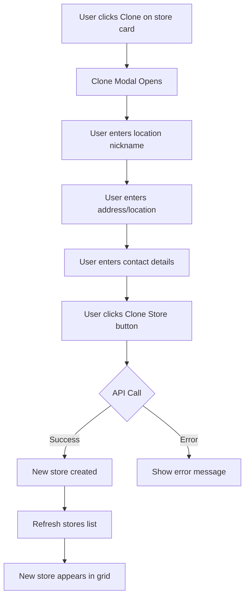

# Clone Store Feature - Multi-Location Implementation Plan

## Overview

The clone feature allows store owners to create a new store location based on an existing store. This is useful for businesses with multiple physical locations that share the same branding, products, services, and overall configuration but have different addresses and contact details.

## How It Works

When a user clicks "Clone" on a store card, the system will create a new store that copies most of the original store's data while allowing for location-specific customizations.

## Data to Clone (Copy)

### ✅ Cloned Data (Shared between locations)
| Field | Description |
|-------|-------------|
| `name` | Store name (same brand) |
| `slogan` | Store slogan |
| `about` | About description |
| `logo` | Logo image and text |
| `departments` | Business departments |
| `trades` | Types of trade (products, services, etc.) |
| `categories` | Product/service categories |
| `socials` | Social media links |
| `operationTimes` | Operating hours (can be customized per location) |
| `layouts` | Website layouts (shared designs) |
| `website` | Website configuration |
| `thumbnails` | Thumbnail images |
| `businessType` | Business type (sole, franchise, etc.) |
| `payment` | Payment configuration |
| `delivers` | Delivery settings |

### ❌ Not Cloned (Unique per location)
| Field | Description |
|-------|-------------|
| `slug` | Unique URL identifier (auto-generated with location suffix) |
| `nickname` | Location nickname (e.g., "Sandton Branch", "CBD Location") |
| `location` | Physical address and coordinates |
| `contact` | Phone, email, WhatsApp (location-specific) |
| `team` | Staff members (may differ per location) |
| `likes` | Start fresh with 0 likes |
| `rating` | Start fresh with 0 ratings |
| `visits` | Start fresh with 0 visits |
| `images` | Gallery images (may be location-specific) |
| `manualStatus` | Store status (start fresh) |
| `isVerified` | Needs separate verification |

## Implementation Steps

### Backend Changes

#### 1. Add Clone Store Controller
**File:** `backend/controllers/StoreController.js`

```javascript
export const cloneStore = expressAsyncHandler(async (req, res) => {
  const { storeId } = req.params;
  const { nickname, location, contact } = req.body;
  const userId = req.user._id;

  // Find original store
  const originalStore = await Store.findById(storeId);
  if (!originalStore) {
    return res.status(404).json({ message: 'Store not found' });
  }

  // Check if user is part of the store team
  const isTeamMember = originalStore.team.some(
    member => member.member.toString() === userId.toString()
  );
  if (!isTeamMember) {
    return res.status(403).json({ message: 'Not authorized to clone this store' });
  }

  // Generate unique slug with location suffix
  const baseSlug = originalStore.slug;
  const locationSuffix = nickname ? generateSlug(nickname) : `location-${Date.now()}`;
  const newSlug = await generateUniqueSlug(`${baseSlug}-${locationSuffix}`);

  // Create cloned store
  const clonedStore = new Store({
    name: originalStore.name,
    nickname: nickname || `${originalStore.name} - New Location`,
    slug: newSlug,
    logo: originalStore.logo,
    slogan: originalStore.slogan,
    thumbnail: originalStore.thumbnail,
    thumbnails: originalStore.thumbnails,
    about: originalStore.about,
    departments: originalStore.departments,
    trades: originalStore.trades,
    categories: originalStore.categories,
    socials: originalStore.socials,
    operationTimes: originalStore.operationTimes,
    layouts: originalStore.layouts,
    website: originalStore.website,
    businessType: originalStore.businessType,
    payment: originalStore.payment,
    delivers: originalStore.delivers,
    location: location || originalStore.location,
    contact: contact || originalStore.contact,
    team: [{ member: userId, role: 'owner' }],
    likes: { count: 0, users: [] },
    rating: { averageRating: 0, numberOfRatings: 0 },
    visits: 0,
    images: [],
    isVerified: false,
  });

  await clonedStore.save();

  // Add store to user's stores array
  await User.findByIdAndUpdate(userId, { $push: { stores: clonedStore._id } });

  res.status(201).json({
    message: 'Store cloned successfully',
    store: clonedStore
  });
});
```

#### 2. Add Route
**File:** `backend/routes/storeRoutes.js`

```javascript
router.post('/:storeId/clone', protect, cloneStore);
```

### Frontend Changes

#### 1. Add Clone Modal Component
**File:** `frontend/src/components/the_mall/my_stores/CloneStoreModal.tsx`

A modal that collects:
- Location nickname (e.g., "Sandton Branch")
- Address/Location (using map picker or address input)
- Contact details (phone, email, WhatsApp)

#### 2. Update MyStoreCard
**File:** `frontend/src/components/the_mall/my_stores/MyStoreCard.tsx`

Update the `handleClone` function to:
1. Open the clone modal
2. Collect location-specific data
3. Call the clone API endpoint
4. Refresh the stores list

#### 3. Add Redux Action
**File:** `frontend/src/features/stores/storeSlice.ts`

```typescript
export const cloneStore = createAsyncThunk(
  'stores/cloneStore',
  async ({ storeId, data }: { storeId: string; data: CloneStoreData }) => {
    const response = await axios.post(`/api/stores/${storeId}/clone`, data);
    return response.data;
  }
);
```

## User Flow



## Database Considerations

### Optional: Add Parent Store Reference
For better multi-location management, consider adding a `parentStore` field:

```javascript
parentStore: {
  type: mongoose.Schema.Types.ObjectId,
  ref: 'Store',
  default: null
}
```

This would allow:
- Grouping locations under a parent brand
- Bulk updates across all locations
- Location hierarchy management

## Future Enhancements

1. **Location Dashboard** - View all locations from a single dashboard
2. **Bulk Updates** - Update products/services across all locations
3. **Location Analytics** - Compare performance across locations
4. **Staff Assignment** - Assign staff to specific locations
5. **Inventory Management** - Track inventory per location

## API Endpoint Summary

| Method | Endpoint | Description |
|--------|----------|-------------|
| POST | `/api/stores/:storeId/clone` | Clone a store for a new location |

## Request/Response Examples

### Clone Store Request
```json
{
  "nickname": "Sandton City Branch",
  "location": {
    "type": "Point",
    "coordinates": [28.0567, -26.1076],
    "address": "Sandton City Mall, Johannesburg"
  },
  "contact": {
    "phone": "+2711234567",
    "email": "sandton@brand.co.za",
    "whatsapp": "+2711234567"
  }
}
```

### Clone Store Response
```json
{
  "message": "Store cloned successfully",
  "store": {
    "_id": "new-store-id",
    "name": "Original Store Name",
    "nickname": "Sandton City Branch",
    "slug": "original-store-name-sandton-city-branch",
    ...
  }
}
```
