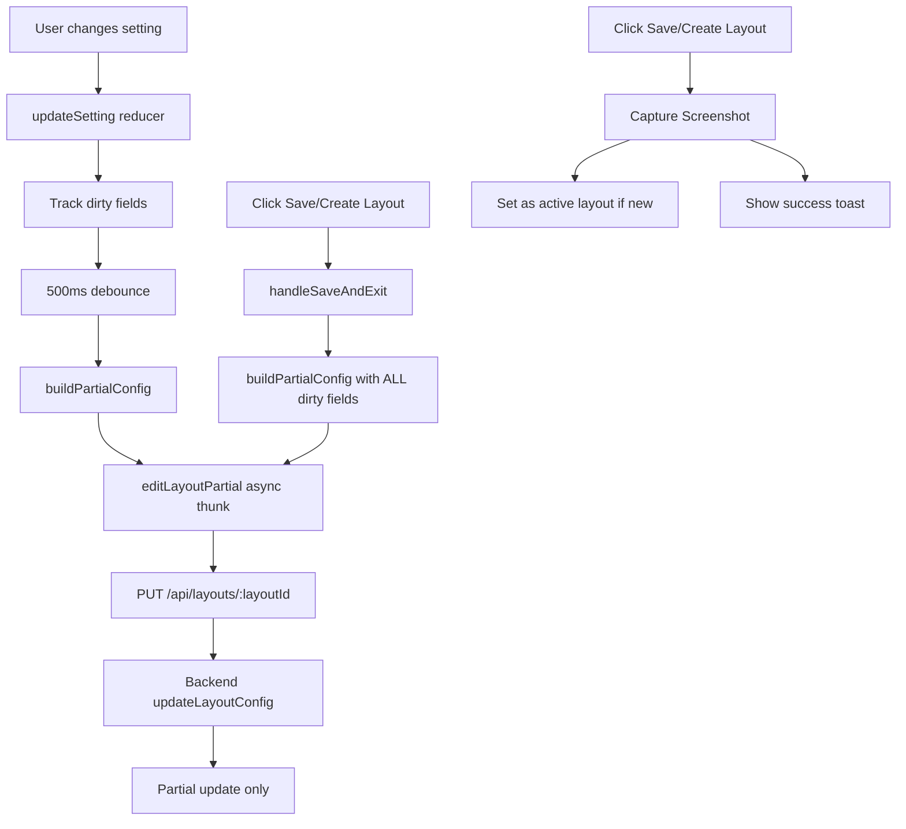

# Implementation Plan: Partial Update Autosave for WebsiteBuilder

## Objective
Implement an autosave feature that sends only the updated fields (not the entire layoutSettings object) to the backend when changes are made, and ensure the Save/Create Layout button in TopBar also uses partial updates.

## Requirements
- **Debounce timing**: 500ms after last change
- **Fields to track**: ALL fields that `updateLayoutConfig` handles in backend
- **Save button behavior**: Should also use partial updates (not full layoutSettings)

---

## Current Code Analysis

### Backend: `StoreLayoutController.js` (lines 252-379)
The `updateLayoutConfig` function already supports partial updates - it only updates fields that are present in the request body:
```javascript
if (body.name) { layout.name = body.name; }
if (body.sections?.about) { layout.sections.about = body.sections.about; }
// ... etc for all fields
```

### Frontend: Current Behavior
- **WebsiteBuilder.tsx** (line 128-131): Sends FULL `settings` object:
  ```typescript
  await dispatch(editLayout({
    layoutId: settings._id as string,
    layoutConfig: settings,
  }));
  ```
- **TopBar.tsx**: Calls `onSave` prop which triggers `handleSaveAndExit` in WebsiteBuilder

### Fields to Track (from backend updateLayoutConfig)
1. `store`
2. `background`
3. `floats`
4. `routes`
5. `routeOrder`
6. `name`
7. `menubar`
8. `colors`
9. `fonts`
10. `sections` (all sub-sections):
    - `sections.footer`
    - `sections.about`
    - `sections.hero`
    - `sections.products`
    - `sections.FAQs`
    - `sections.searchResults`
    - `sections.contact`
    - `sections.reviews`
    - `sections.gallery`
    - `sections.singleProduct`
    - `sections.services`
    - `sections.bookService`
    - `sections.rentals`
    - `sections.donations`
    - `sections.packages`
    - `sections.book`
    - `sections.menu`

---

## Implementation Steps

### Step 1: Create Partial Update Async Thunk
**File**: `frontend/src/features/layouts/layoutSlice.ts`

Add a new async thunk that sends only the specified partial fields:

```typescript
export const editLayoutPartial = createAsyncThunk(
  'layouts/editLayoutPartial',
  async ({ layoutId, partialConfig }: { layoutId: string; partialConfig: any }) => {
    const response = await axios.put(`${API_URL}/api/layouts/${layoutId}`, partialConfig);
    return response.data;
  }
);
```

### Step 2: Modify WebsiteBuilder.tsx to Track Changes
**File**: `frontend/src/pages/layout_editor/WebsiteBuilder.tsx`

1. Add state to track dirty (modified) fields:
   ```typescript
   const [dirtyFields, setDirtyFields] = useState<Set<string>>(new Set());
   ```

2. Add a useEffect that listens to settings changes and tracks dirty fields:
   ```typescript
   useEffect(() => {
     // Compare current settings with previous to detect changes
     // Track which fields changed and add to dirtyFields
   }, [settings]);
   ```

3. Add autosave with 500ms debounce:
   ```typescript
   useEffect(() => {
     const timeout = setTimeout(() => {
       if (dirtyFields.size > 0) {
         // Build partial config from dirty fields
         const partialConfig = buildPartialConfig(dirtyFields, settings);
         dispatch(editLayoutPartial({ layoutId, partialConfig }));
         setDirtyFields(new Set()); // Clear after save
       }
     }, 500);
     
     return () => clearTimeout(timeout);
   }, [dirtyFields, settings, layoutId]);
   ```

4. Modify `handleSaveAndExit` to use partial updates:
   ```typescript
   // Option A: Use all dirty fields (same as autosave)
   // Option B: For explicit save, could also send full config if needed
   // Based on requirements: Use same partial update logic
   ```

### Step 3: Modify TopBar onSave Behavior
**File**: `frontend/src/components/layout_settings/topbar/TopBar.tsx`

The TopBar already passes `onSave` prop. The WebsiteBuilder handles it. The key is that `handleSaveAndExit` in WebsiteBuilder should use partial updates (same as autosave).

---

## Helper Functions Needed

### `buildPartialConfig`
Builds a partial config object containing only the specified dirty fields:

```typescript
function buildPartialConfig(dirtyFields: Set<string>, fullSettings: any) {
  const partialConfig: any = {};
  
  dirtyFields.forEach(field => {
    if (field.startsWith('sections.')) {
      // Handle nested sections
      const sectionKey = field.replace('sections.', '');
      partialConfig.sections = partialConfig.sections || {};
      partialConfig.sections[sectionKey] = fullSettings.sections?.[sectionKey];
    } else {
      partialConfig[field] = fullSettings[field];
    }
  });
  
  return partialConfig;
}
```

---

## Architecture Overview



---

## Testing Checklist

1. **Autosave triggers on change**: Verify that changing any setting triggers autosave after 500ms
2. **Partial data sent**: Verify that only changed fields are sent in the request body
3. **Save/Create Layout works**: Verify that the TopBar save button works with partial updates
4. **History still works**: Verify that undo/redo still functions correctly
5. **Screenshot capture**: Verify that screenshot is still captured for new layouts

---

## Notes

- The backend already supports partial updates - no backend changes needed
- The `editLayout` thunk can continue to be used for full saves if needed in the future
- The autosave should not interfere with undo/redo history
- Consider adding a visual indicator when autosave is in progress (optional)
